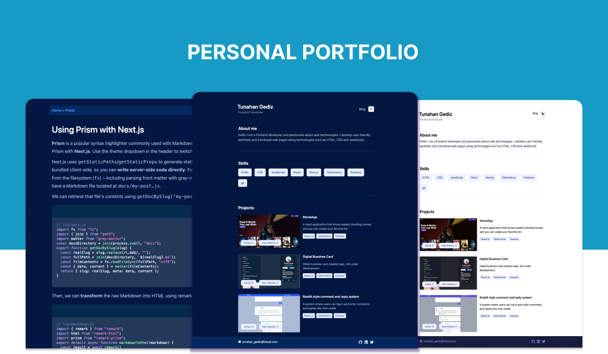

<!-- Improved compatibility of back to top link: See: https://github.com/othneildrew/Best-README-Template/pull/73 -->

<a name="readme-top"></a>

<!-- TABLE OF CONTENTS -->

You can see project [Live Preview ](https://tunahangediz.com)

<details>
  <summary>Table of Contents</summary>
  <ol>
    <li>
      <a href="#about-the-project">About The Project</a>
      <ul>
        <li><a href="#built-with">Built With</a></li>
      </ul>
    </li>
    <li>
      <a href="#getting-started">Getting Started</a>
      <ul>
        <li><a href="#installation">Installation</a></li>
      </ul>
    </li>

  </ol>
</details>

<!-- ABOUT THE PROJECT -->

## About The Project

[](https://tunahangediz.com)
My personal portfolio website that I created with Next.js

### Built With

- [![React][next.js]][next-url]
- [![TailwindCss][tailwindcss.com]](https://tailwindcss.com)

### Technologies and methods I used in the project

- [firebase realtime db](firebase.com): used for visiters counter
- [MDXBundler](https://github.com/kentcdodds/mdx-bundler): used for generating user firendly post with mdx
- [Prism]: for syntax highlighting

<!-- GETTING STARTED -->

### You can use this project freely for building your own portfolio

### Installation

1. Clone the repo
   ```sh
   git clone https://github.com/tunahangediz/personal-portfolio
   ```
2. Install NPM packages
   ```sh
   npm install
   ```
3. Start project

   ```sh
   npm run dev

   ```

<!-- USAGE EXAMPLES -->

## Contact

Tunahan Gediz - [@tunahangediz](https://mobile.twitter.com/tunahangediz) - tunahan_gediz@icloud.com

<p align="right">(<a href="#readme-top">back to top</a>)</p>

<!-- MARKDOWN LINKS & IMAGES -->
<!-- https://www.markdownguide.org/basic-syntax/#reference-style-links -->

[contributors-shield]: https://img.shields.io/github/contributors/github_username/repo_name.svg?style=for-the-badge
[contributors-url]: https://github.com/github_username/repo_name/graphs/contributors
[forks-shield]: https://img.shields.io/github/forks/github_username/repo_name.svg?style=for-the-badge
[forks-url]: https://github.com/github_username/repo_name/network/members
[stars-shield]: https://img.shields.io/github/stars/github_username/repo_name.svg?style=for-the-badge
[stars-url]: https://github.com/github_username/repo_name/stargazers
[issues-shield]: https://img.shields.io/github/issues/github_username/repo_name.svg?style=for-the-badge
[issues-url]: https://github.com/github_username/repo_name/issues
[license-shield]: https://img.shields.io/github/license/github_username/repo_name.svg?style=for-the-badge
[license-url]: https://github.com/github_username/repo_name/blob/master/LICENSE.txt
[linkedin-shield]: https://img.shields.io/badge/-LinkedIn-black.svg?style=for-the-badge&logo=linkedin&colorB=555
[linkedin-url]: https://linkedin.com/in/linkedin_username
[product-screenshot]: images/tunahangediz.png
[next.js]: https://img.shields.io/badge/next.js-000000?style=for-the-badge&logo=nextdotjs&logoColor=white
[next-url]: https://nextjs.org/
[react.js]: https://img.shields.io/badge/React-20232A?style=for-the-badge&logo=react&logoColor=61DAFB
[react-url]: https://reactjs.org/
[vue.js]: https://img.shields.io/badge/Vue.js-35495E?style=for-the-badge&logo=vuedotjs&logoColor=4FC08D
[vue-url]: https://vuejs.org/
[angular.io]: https://img.shields.io/badge/Angular-DD0031?style=for-the-badge&logo=angular&logoColor=white
[angular-url]: https://angular.io/
[svelte.dev]: https://img.shields.io/badge/Svelte-4A4A55?style=for-the-badge&logo=svelte&logoColor=FF3E00
[svelte-url]: https://svelte.dev/
[laravel.com]: https://img.shields.io/badge/Laravel-FF2D20?style=for-the-badge&logo=laravel&logoColor=white
[laravel-url]: https://laravel.com
[bootstrap.com]: https://img.shields.io/badge/Bootstrap-563D7C?style=for-the-badge&logo=bootstrap&logoColor=white
[bootstrap-url]: https://getbootstrap.com
[jquery.com]: https://img.shields.io/badge/jQuery-0769AD?style=for-the-badge&logo=jquery&logoColor=white
[jquery-url]: https://jquery.com
[tailwindcss.com]: https://img.shields.io/badge/tailwindcss-%2338B2AC.svg?style=for-the-badge&logo=tailwind-css&logoColor=white
